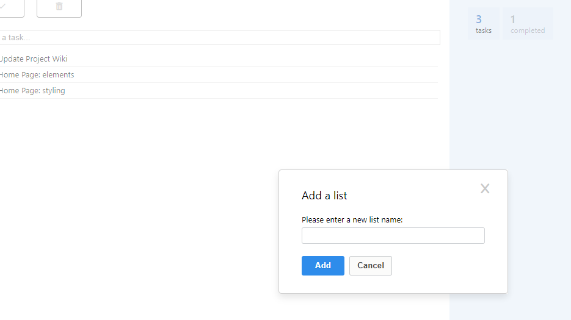
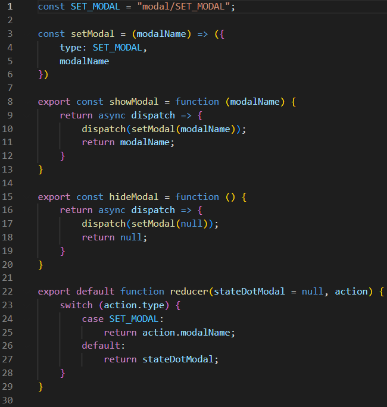

# Remember the Milk Clone
This student project is a clone of the online to-do list app [Remember the Milk](https://www.rememberthemilk.com/). The project was made by [Nathaniel Tseng](https://github.com/ntseng) with the MVP and some bonus features being completed between Feb 14th 2022 and Feb 25th 2022. Some additional bonus features were completed between (insert dates of 2 week sprint).

## Local Viewing Instructions
1. Clone this repo
2. Run `npm install` from the root directory, this should install for both `/backend` and `/frontend` which have separate dependencies
3. Make a postgres database
4. Make a copy of `.env.example` in `/backend` and rename it to `.env`
5. Populate your new `.env` with your database login values
5. Run `npm start` in BOTH `/backend` and `/frontend` directories
6. Go to `http://localhost:3000/` in any browser

## Time Budget
Time Allotted: 80 person*hours

Completion of MVP: 50 person*hours

Time Spent on Bonus Features: 30 person*hours + (update with time from 2 week sprint)

## Links
- [Live Site](https://aa-capstone.herokuapp.com/)
- [Scorecard](https://docs.google.com/spreadsheets/d/1oUYEFjFufv3GhipZB3FYK4PMajOvvq6wDjri6ycO6PM/)
- [DB Schema](https://github.com/ntseng/aa-capstone/wiki/DB-Schema)
- [Feature List](https://github.com/ntseng/aa-capstone/wiki/Feature-List)
- [Technology List](https://github.com/ntseng/aa-capstone/wiki/Technology-List)
- [User Stories](https://github.com/ntseng/aa-capstone/wiki/User-Stories)
- [Wireframes](https://github.com/ntseng/aa-capstone/wiki/Wireframes)

## Challenges
Modals can be an effective tool in the visual designer's toolbox. By placing the interface on top of other elements while applying a mask to those elements, the user retains context about what they were doing previously while still being allowed to focus on that task at hand.

However, managing state for modals can prove to be cumbersome and unintuitive. How can one ensure that multiple modals aren't opened simultaneously? How should the modal pass information back to the main application? If a page has the potential to show multiple different modals (as is the case on the main app page of this project), is there a way to separate the modal's concerns from it's parent page's concerns?

The solution I arrived at was to create a separate Redux store for modal state management. Fortunately, the state only required one value: an identifier for the modal that was open at the time (or a null value if no modal was open). By storing a string identifier or null as the value, the store's complexity was kept to a minimum while satisfying the other constraint for managing modal state.

By having a single value within the single source of truth that is the Redux store, it would be ensured that there would never be any conflicts with multiple modals opening at the same time. Additionally, using a store presented an opportunity to create an interface to modal state changes, abstracting away the state management details (ie allowing the creation of the `hideModal()` function). Finally, being able to interact with the store from any component allowed splitting each of the modals off into their own component, allowing for improved modularization.

Though increasing the complexity of the store, this implementation mitigates many of the complexities inherent to using modals in a site's design, significantly reducing the increase in maintenance caused by adding modals to the site.
